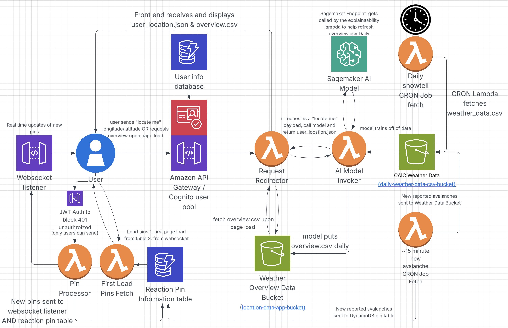

# Avalanche Predictor

   AI-powered avalanche prediction system using AWS Lambda and machine learning.

   ## Architecture

   ## Project Structure
   - `lambda/` - AWS Lambda functions
   - `ai-model/` - Machine learning model code
   - `data/` - Training and processed data
   - `infrastructure/` - AWS infrastructure as code
   - `tests/` - Unit and integration tests

   ## Team Responsibilities
   - DevOps: Dylan
   - AI Model: Kevin, Andy, Sam
   - Lambda/Data: Eddie
   - Frontend: Robbey, Tyler
